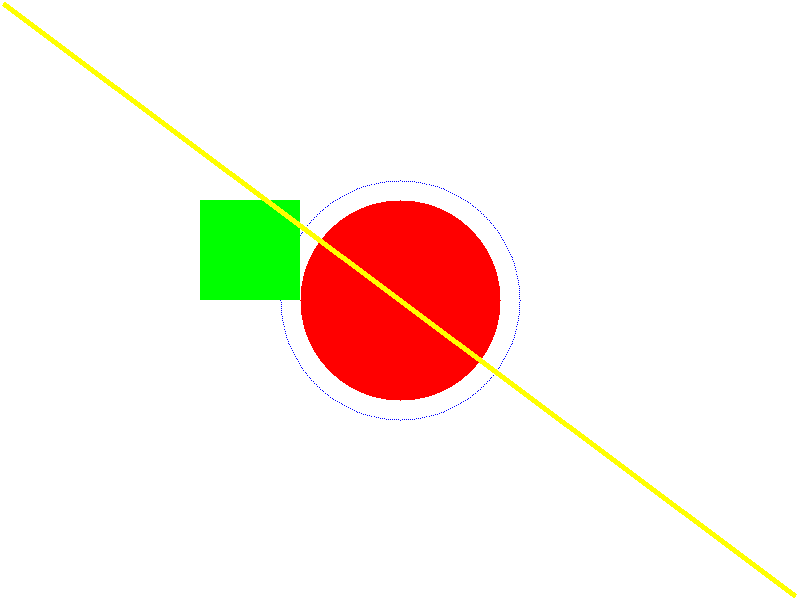
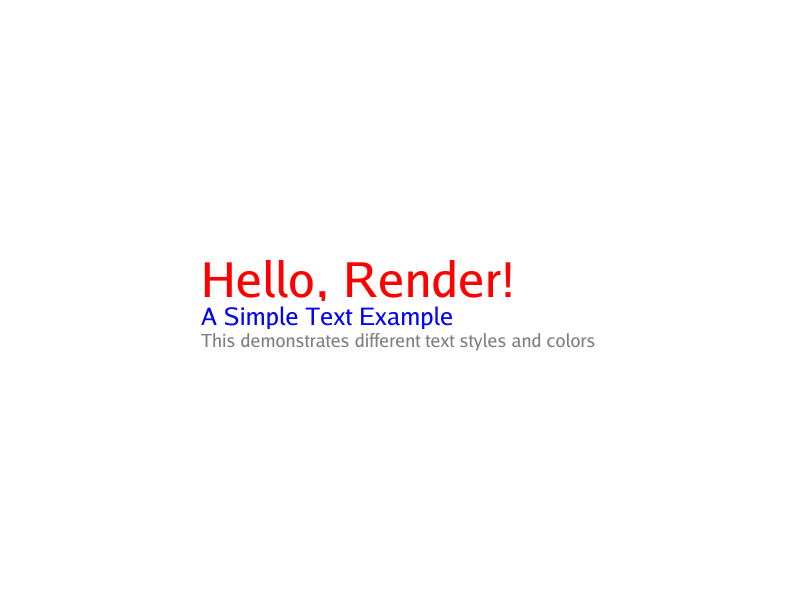
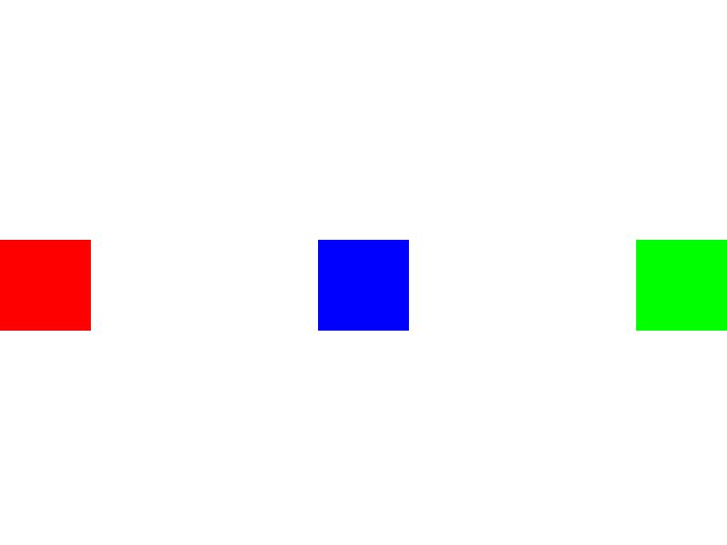
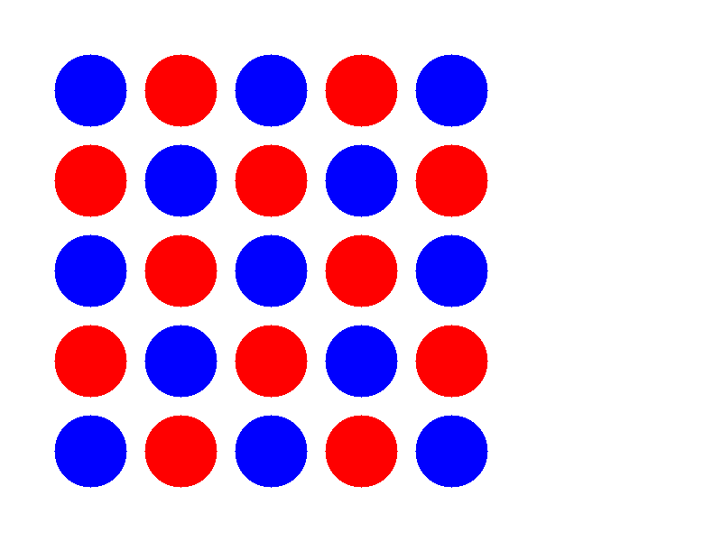

# Render

A Go library for creating and rendering 2D graphics with a focus on layout and composition.

## Overview

Render is a flexible 2D graphics library that allows you to create complex layouts and compositions using a tree-based rendering system. It provides a simple API for drawing shapes, text, and custom graphics while handling layout and alignment automatically.

## Features

- **Canvas-based Drawing**: Draw basic shapes (circles, rectangles, lines) with customizable colors and styles
- **Layout System**:
  - Row and Column layouts for organizing elements
  - Flexible alignment options
  - Automatic sizing and spacing
- **Text Rendering**: Support for text with customizable font sizes and colors
- **Custom Rendering**: Create custom render objects by implementing the RenderObject interface
- **PNG Output**: Export your compositions as PNG images

## Project Structure

```
render/
├── canvas/         # Core drawing primitives and canvas implementation
├── render_objects/ # Layout and composition components
├── types/          # Common types and interfaces
└── cmd/            # Example usage and main application
```

## Quick Start

1. Install the package:

```bash
go get github.com/hvuhsg/render
```

2. Create a simple composition:

```go
package main

import (
    "github.com/hvuhsg/render/canvas"
    "github.com/hvuhsg/render/render_objects"
    "github.com/hvuhsg/render/types"
)

func main() {
    // Create a new canvas
    canvas := canvas.NewCanvas(types.Size{Width: 800, Height: 600})

    // Create a text element
    text := render_objects.NewText("Hello, World!", canvas.LightGreen, 36, "default")

    // Center the text
    align := &render_objects.Align{
        Child: text,
        Align: render_objects.AlignCenter,
    }

    // Render and save
    align.Paint(canvas)

    // Save the result
	file, _ := os.Create("result.png")
	defer file.Close()
	png.Encode(file, canvas.Img)
}
```

## Components

### Canvas

The core drawing surface that provides methods for drawing shapes and text.

### Render Objects

- **Text**: Renders text with customizable properties
- **ColoredBox**: A simple colored rectangle
- **Row**: Arranges children horizontally
- **Column**: Arranges children vertically
- **Align**: Centers or aligns a single child
- **Painter**: Custom rendering function wrapper

## Contributing

Contributions are welcome! Please feel free to submit a Pull Request.

## License

This project is licensed under the MIT License - see the LICENSE file for details.

## Examples

### Basic Shapes

This example demonstrates drawing basic shapes. [View the code.](examples/basic_shapes/main.go)



### Text Rendering

This example demonstrates rendering styled text. [View the code.](examples/text_rendering/main.go)



### Layout Composition

This example demonstrates layout composition with rows and columns. [View the code.](examples/layout_composition/main.go)



### Custom Rendering

This example demonstrates custom rendering logic. [View the code.](examples/custom_rendering/main.go)


